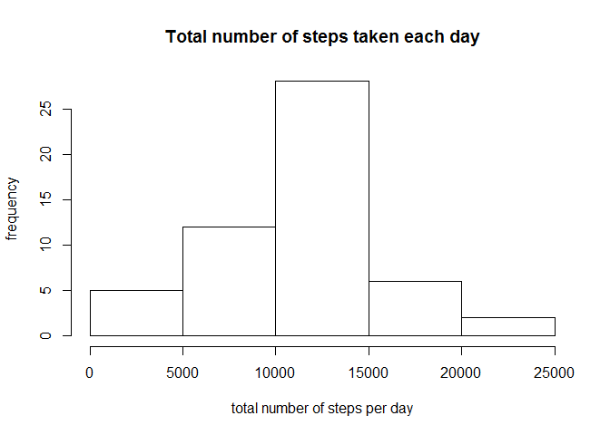
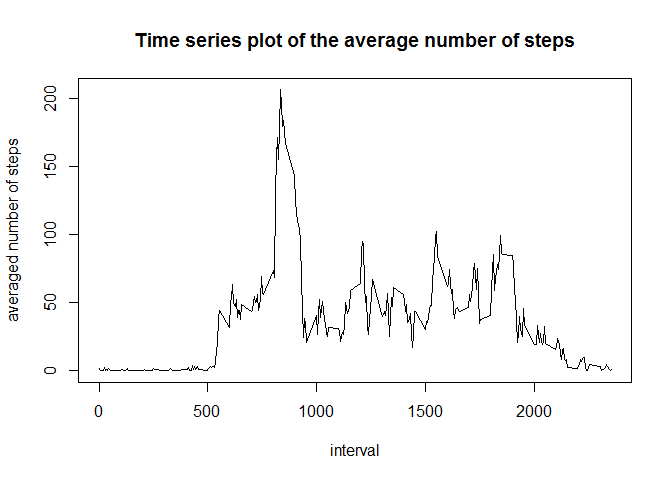
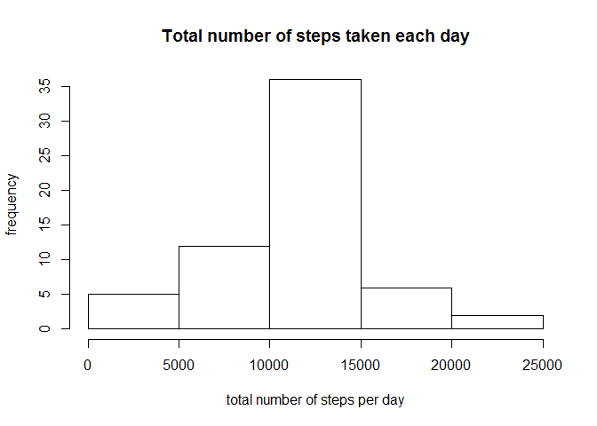
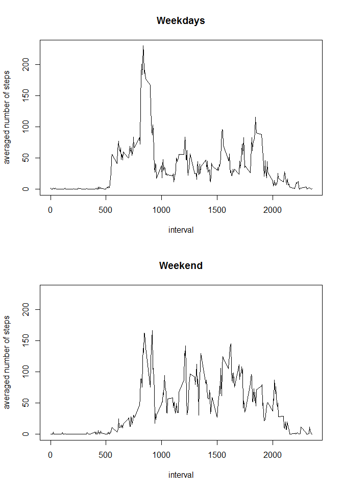

# Reproducible Research: Peer Assessment 1


The data consists of two months of data about personal movement using activity monitoring devices collected during the months of October and November, 2012 and include the number of steps taken in 5 minute intervals each day.


## Loading and preprocessing the data

First, we set the working directory,


```r
setwd("~/Coursera/DataScience/Part 5/Homework/Week_2/RepData_PeerAssessment1")
```

and remove all existing variables and parameters

```r
rm(list=ls(all=TRUE))
```

We then load all libraries necessary for the subsequent analyses

```r
library(dplyr)
```

Finally, we load the data and look at the first 6 rows


```r
if(!file.exists('activity.csv')){
        unzip('activity.zip')
}
data <- read.csv("activity.csv",header = TRUE)
head(data)
```

```
##   steps       date interval
## 1    NA 2012-10-01        0
## 2    NA 2012-10-01        5
## 3    NA 2012-10-01       10
## 4    NA 2012-10-01       15
## 5    NA 2012-10-01       20
## 6    NA 2012-10-01       25
```

For handling dates better, we transform the column 'date' into the 'Date-class'. In addition, as one can clearly see, some of the values are missing. For the subsequent analysis, we create a new data frame (called data1) without the missing values


```r
data$date <- as.Date(data$date,"%Y-%m-%d")
data1 <- data[!is.na(data$steps),]
head(data1)
```

```
##     steps       date interval
## 289     0 2012-10-02        0
## 290     0 2012-10-02        5
## 291     0 2012-10-02       10
## 292     0 2012-10-02       15
## 293     0 2012-10-02       20
## 294     0 2012-10-02       25
```

## What is mean total number of steps taken per day?

To answer this question, we first look at a histogram of the total number of steps taken each day


```r
StepsDay <- aggregate(data1[, 'steps'], by=list(data1$date), FUN=sum)
names(StepsDay) <- c("Day","Total_Steps")

hist(StepsDay$Total_Steps,ylab="frequency",xlab="total number of steps per day",main="Total number of steps taken each day")
```

<!-- -->

Finally, we calculate the mean and the median


```r
MEAN_1 <- round(mean(StepsDay$Total_Steps))
MEDAIN_1 <- median(StepsDay$Total_Steps)
```

The mean is given by 10766 and the median is 10765. 


## What is the average daily activity pattern?

To answer this questions, let us first look at a time series plot of the average number of steps taken in each 5-min interval (averaged across days)


```r
StepsInterval <- aggregate(data1[, 'steps'], by=list(data1$interval), FUN=mean)
names(StepsInterval) <- c("Interval","MeanSteps")

plot(StepsInterval$Interval,StepsInterval$MeanSteps,type='l',xlab="interval",ylab="averaged number of steps",main="Time series plot of the average number of steps")
```

<!-- -->

For a better understanding, let us compute the maximum number of steps and the corresponding 5-min interval


```r
MaxStep <- StepsInterval$Interval[which(StepsInterval$MeanSteps==max(StepsInterval$MeanSteps))]
```

The time interval with the maximal number of steps is 835

## Imputing missing values

Next, we ask if the missing values have a profound effect on our analyses. Therefore, we first check how many missing values are present


```r
sum(is.na(data$steps))
```

```
## [1] 2304
```

We then impute values for each missing interval by using the rounded averaged steps taken for the respective interval 


```r
data2 <- data
for (i in 0:471){
        idx <- which((is.na(data2$steps)) & (data2$interval==5*i))
        data2$steps[idx] <- round(StepsInterval$MeanSteps[StepsInterval$Interval==5*i])
}
head(data2)
```

```
##   steps       date interval
## 1     2 2012-10-01        0
## 2     0 2012-10-01        5
## 3     0 2012-10-01       10
## 4     0 2012-10-01       15
## 5     0 2012-10-01       20
## 6     2 2012-10-01       25
```

Finally we look at the new histogram of total number of steps taken each day


```r
StepsDayNew <- aggregate(data2[, 'steps'], by=list(data2$date), FUN=sum)
names(StepsDayNew) <- c("Day","Total_Steps")

hist(StepsDayNew$Total_Steps,ylab="frequency",xlab="total number of steps per day",main="Total number of steps taken each day")
```

<!-- -->

and redo the mean and the median


```r
MEAN_2 <- round(mean(StepsDayNew$Total_Steps))
MEDIAN_2 <- median(StepsDayNew$Total_Steps)
```

The new mean is 10766 and the new median is 10762. Both values are very close to the values we had before. Hence, we can conclude that the missing values did not make a huge difference (at least for the imputing method used here).

## Are there differences in activity patterns between weekdays and weekends?

To answer this question, we add another column, which is a factor and describes if a respective day was in the week or on a weekend


```r
wkdays=c("Montag","Dienstag","Mittwoch","Donnerstag","Freitag")
wkend=c("Samstag","Sonntag")
data2 <- mutate(data2, WeekFactor = factor(case_when(weekdays(date) %in% wkdays ~ "weekday",weekdays(date) %in% wkend ~ "weekend")))
head(data2)
```

```
##   steps       date interval WeekFactor
## 1     2 2012-10-01        0    weekday
## 2     0 2012-10-01        5    weekday
## 3     0 2012-10-01       10    weekday
## 4     0 2012-10-01       15    weekday
## 5     0 2012-10-01       20    weekday
## 6     2 2012-10-01       25    weekday
```

We then compute the histogram data for the respective factor (weekday or weekend):


```r
data2WD <- data2[data2$WeekFactor=="weekday",]
data2WE <- data2[data2$WeekFactor=="weekend",]

StepsInterval.data2WD <- aggregate(data2WD[, 'steps'], by=list(data2WD$interval), FUN=mean)
names(StepsInterval.data2WD) <- c("Interval","MeanSteps")

StepsInterval.data2WE <- aggregate(data2WE[, 'steps'], by=list(data2WE$interval), FUN=mean)
names(StepsInterval.data2WE) <- c("Interval","MeanSteps")
```

Finally, we set the plotting environment and plot both time series in separate panels


```r
par(mfrow = c(2, 1))

plot(StepsInterval.data2WD$Interval,StepsInterval.data2WD$MeanSteps,type='l',xlab="interval",ylab="averaged number of steps",main="Weekdays",ylim=c(0,230))
plot(StepsInterval.data2WE$Interval,StepsInterval.data2WE$MeanSteps,type='l',xlab="interval",ylab="averaged number of steps",main="Weekend",ylim=c(0,230))
```

<!-- -->

Clearly, one can see a few differences between "weekdays" and "weekend". For weekdays, the maximal value reached is much higher. However, the values between 1000 and 2000 are higher (on average) for the weekend.


